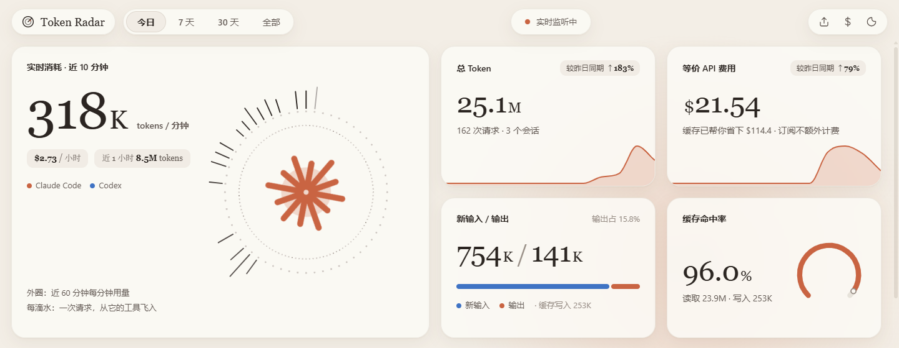

<p align="center">
  
</p>

<h1 align="center">Token Radar</h1>

<p align="center">
  自动发现本机的 AI 编程工具，实时监控 token 消耗、费用与订阅额度的桌面应用<br />
  <sub>Real-time token, cost &amp; quota monitor for Claude Code and Codex — reads local logs, no API key needed.</sub>
</p>

<p align="center">
  <a href="https://github.com/seaways1015-afk/token-radar/releases/latest">下载（Windows / macOS / Linux）</a> ·
  <a href="#从源码运行">从源码运行</a> ·
  <a href="#english">English</a>
</p>



## 特点

- **本地运行**：直接读取本机的会话日志，不需要 API Key，数据不上传。只有你手动点“联网同步价格”时才会联网
- **实时**：日志一有新写入，面板在 1～2 秒内更新；每次请求化作一滴水，从对应工具的方向飞入中心
- **订阅自动识别**：自动识别 Claude Pro / Max、ChatGPT Plus / Pro 等套餐，按 API 价折算等价费用并和月费比较（已用出 xx% 月费 / 已回本 N×）
- **Codex 额度**：显示 5 小时 / 每周额度使用率和重置倒计时
- **很快**：增量读取，500MB 日志首次扫描不到 1 秒，之后读缓存秒开

| 数据源 | 日志位置 |
|---|---|
| Claude Code（CLI / 桌面版 / IDE 插件） | `~/.claude/projects/**/*.jsonl`（或 `$CLAUDE_CONFIG_DIR/projects`） |
| Codex（CLI / 桌面版） | `~/.codex/sessions/**/*.jsonl`（或 `$CODEX_HOME/sessions`） |
| [Pi](https://github.com/earendil-works/pi)（任意供应商：DeepSeek、OpenRouter、自建中转等） | `~/.pi/agent/sessions/**/*.jsonl`（或 `$PI_CODING_AGENT_DIR/sessions`） |
| [OpenCode](https://opencode.ai)（任意供应商） | `~/.local/share/opencode/opencode.db`（SQLite，只读） |
| DeepSeek Harness（实验性） | `~/.dsh/sessions/**/*.jsonl(.zstd)` |

### 本机工具扫描

启动后会自动扫描本机装了哪些 AI 编程工具（检查配置目录和 PATH 上的命令，每分钟重扫一次，新装的工具会自动出现），并标出状态：

- **监控中**：已接入用量解析，且已有数据
- **已接入 · 暂无数据**：支持解析，但还没产生请求
- **不支持用量**：本地找不到 token 用量记录，例如 Cursor、GitHub Copilot、Qoder、Trae 这类在服务端计费的工具，以及 Kimi Code、Antigravity 等暂未接入的工具

目前能识别的工具：Claude Code、Codex、Pi、OpenCode、DeepSeek Harness、Kimi Code、Gemini CLI、Antigravity、Qwen Code、GitHub Copilot、Cursor、Qoder、Trae / MarsCode、Windsurf、Cline / Roo Code、Crush、iFlow CLI、Factory Droid、CodeBuddy、Aider。

## 功能

- **实时消耗**：近 10 分钟 tokens/分钟、近 1 小时费用；外圈 60 根刻度是近 60 分钟逐分钟用量
- **总 Token / 预估费用**：与上一同期对比（今日对比昨日同一时刻），带趋势小图，显示缓存帮你省下的钱
- **新输入 / 输出**、**缓存命中率**（读取 ÷ (读取 + 新输入 + 写入)）
- **Agent 工具卡片**：套餐、本月折算、额度，Pi / OpenCode 还会显示用到的供应商和模型；点击后整个面板只看该工具的数据
- 用量趋势（按工具堆叠）、模型分布、项目 Top、工具调用 Top、最近请求流
- **计费设置**（右上角 `$`）
  - 「自动扫描」：识别当前订阅并填入月费
  - 「联网同步价格」：从 [LiteLLM 公开价格表](https://github.com/BerriAI/litellm) 为未计价的模型填入单价
  - 都可以手动修改，点保存才生效
- 今日 / 7 天 / 30 天 / 全部，导出 CSV，深色模式，窗口置顶，迷你悬浮窗，托盘常驻

## 下载

在 [Releases](https://github.com/seaways1015-afk/token-radar/releases/latest) 下载：

| 系统 | 文件 |
|---|---|
| Windows | `TokenRadar-Setup-x.y.z.exe`（安装版）、`TokenRadar-x.y.z-portable.exe`（免安装版） |
| macOS | `TokenRadar-x.y.z-mac-arm64.dmg`（Apple 芯片）、`TokenRadar-x.y.z-mac-x64.dmg`（Intel） |
| Linux | `TokenRadar-x.y.z-linux-x86_64.AppImage` |

> 安装包没有代码签名：
> - Windows 首次运行时 SmartScreen 可能提示“未知发布者”，点「更多信息 → 仍要运行」
> - macOS 提示“无法验证开发者”时，在「系统设置 → 隐私与安全性」里点「仍要打开」，或运行 `xattr -cr "/Applications/Token Radar.app"`

## 从源码运行

需要 Node.js 18+。

```bash
git clone https://github.com/seaways1015-afk/token-radar.git
cd token-radar
npm install
npm start        # 桌面版（Electron）
npm run web      # 浏览器版：启动本地服务并打开 http://127.0.0.1:17321
npm run dist     # 打包 Windows 安装版 + 免安装版到 dist/
```

### 发布新版本

安装包由 GitHub Actions 自动构建（`.github/workflows/release.yml`）：把 `package.json` 的 `version` 改成新版本并提交，然后推送同名标签，Windows / macOS / Linux 三个平台会自动打包并发布到 Releases。

```bash
git tag v0.2.0
git push origin main v0.2.0
```

## 订阅识别是怎么做的

| 工具 | 读取位置 | 字段 |
|---|---|---|
| Claude Code | `~/.claude.json` | `oauthAccount.organizationType` / `organizationRateLimitTier` |
| Codex | 会话日志里的 `rate_limits` | `plan_type`、`primary` / `secondary`（额度） |

不会读取任何含登录凭证的文件（`~/.claude/.credentials.json`、`~/.codex/auth.json`）。设置了 `ANTHROPIC_API_KEY` 时 Claude 视为 API 按量计费。

Claude Code 的日志里没有额度使用率，所以 Claude 只显示折算费用，不显示剩余额度。

## 实现要点

- `server/collector.js`：按字节偏移增量读取日志，只处理新增行；`fs.watch` 触发 + 1.5 秒轮询热文件 + 30 秒全量兜底
  - Claude：同一条消息会按内容块拆成多行写入，按 `message.id + requestId` 去重
  - Codex：优先读 `token_usage_record`（按 `response_id` 去重），旧版本回退到 `token_count` 事件；`input_tokens` 已包含缓存命中部分，新输入 = input − cached
- `server/stats.js`：按时间范围 / 工具聚合；`server/plans.js`：订阅识别；`server/pricing.js`：定价
- `server/pricing.json` 内置 Claude 官方价格（缓存写入 5 分钟 1.25x、1 小时 2x）
- 数据目录 `~/.token-radar/`：`cache.json`（解析缓存）、`pricing.user.json`、`plans.user.json`（你的设置）
- 前端是纯 HTML/CSS/SVG，没有框架依赖；`electron/` 只是一层无边框窗口 + 托盘外壳

费用是按公开 API 价格估算的等价成本，仅供参考；订阅用户的实际账单以官方为准。

Pi / OpenCode 的费用：工具自己记录了费用（pi 在 `models.json` 里配置了 `cost`、OpenCode 按供应商价格计算）时直接使用；名字以 `-free` 结尾的免费模型按 $0 计；否则按本应用的价格表计算（可联网同步或手动填写，也支持按 `供应商/模型` 单独定价）。

欢迎 PR 接入更多工具：在 `server/tools.js` 登记检测规则，在 `server/collector.js` 加一个解析函数即可。

## English

Token Radar is a desktop dashboard (Electron) that watches the local session logs of **Claude Code** and **Codex** and shows, in real time:

- tokens per minute, hourly cost, and a 60-minute radial activity ring where every request flies in as a drop
- total tokens, estimated cost (vs. the same time yesterday), new input / output, cache hit rate
- per-tool cards with the detected subscription plan (Claude Pro/Max, ChatGPT Plus/Pro), month-to-date API-equivalent value vs. your subscription fee, and Codex 5-hour / weekly quota usage
- trends, model / project / tool-call breakdowns, and a live request feed

Everything runs locally; no API key is required and nothing is uploaded. The only network call is the optional "sync prices" button, which pulls model prices from LiteLLM's public price list.

```bash
npm install && npm start
```

## License

[MIT](LICENSE)
